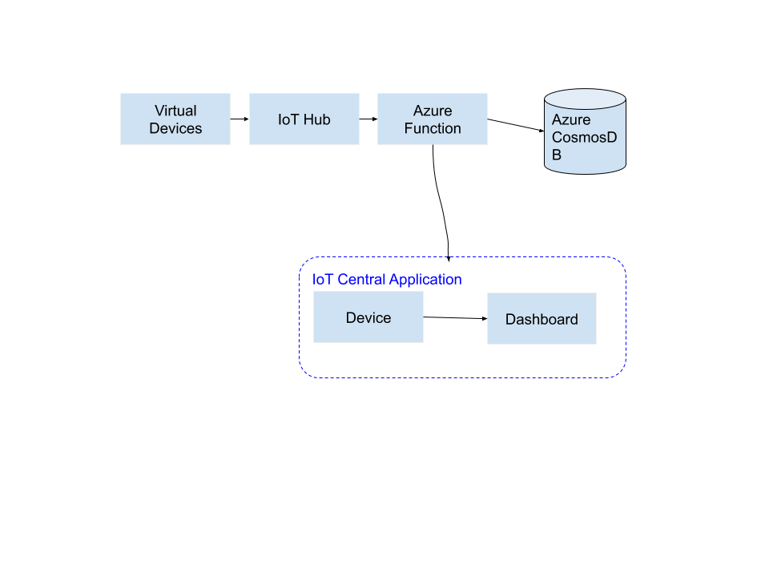
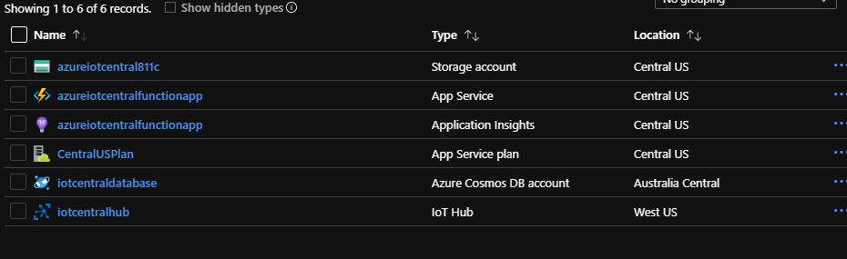
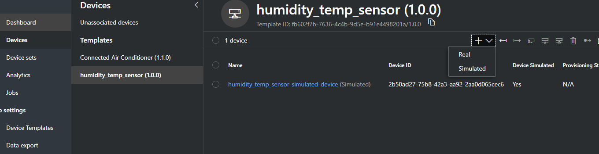
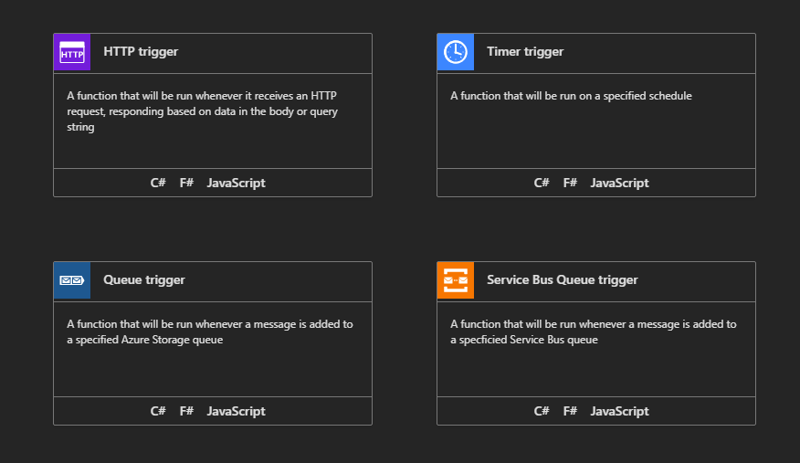
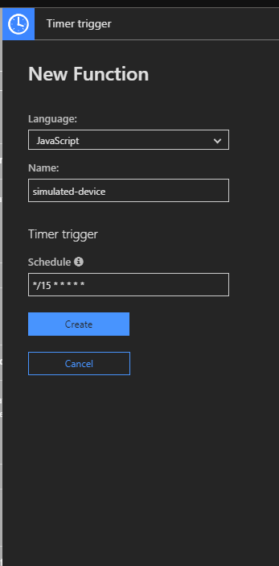
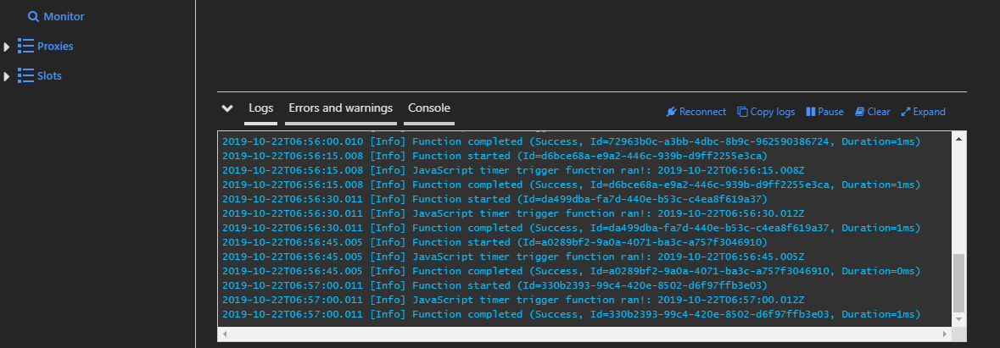

# Azure IoT Central PoC Demo

This is a demo to show how Azure IoT Hub and Azure IoT Central Services can be used to deliver an end-to-end IoT solution, from devices to visualization in IoT Central dashboard.

## Overview of What We'll build

We will build a simple and common IoT flow, where we have a device (which we will simulate), it securely connects to an endpoint in the cloud and sends its telemetry. We will then process this telemetry and store the data in a database. Finally, we will visualize the transformed telemetry information for business intelligence.

The architecture below visualizes the major components of the solution:



To put the solution together, we will make use the following Azure services:

- **Azure IoT Hub** - IoT Hub is a managed service, hosted in the cloud, that acts as a central message hub for bi-directional communication between your IoT application and the devices it manages.
- **Azure IoT Central** - Azure IoT Central is a fully managed SaaS (software-as-a-service) solution that makes it easy to connect, monitor and manage your IoT assets at scale.
- **Azure Functions** - Azure Functions is a serverless compute service that lets you run event-triggered code without having to explicitly provision or manage infrastructure.
- **Azure Cosmos DB** - Azure Cosmos DB is Microsoft’s globally distributed, multi-model database service for operational and analytics workloads. It offers multi-mastering feature by automatically scaling throughput, compute, and storage.

## What You'll need

- Azure account with a subscription
- A text editor
- Deployment code and files found in this folder
- Basic knowledge of any programming language

## Instructions

1.  We are going to use Azure CLI to deploy some of the resources.The Azure command-line interface (CLI) is Microsoft's cross-platform command-line experience for managing Azure resources. Head over to https://docs.microsoft.com/en-us/cli/azure/install-azure-cli?view=azure-cli-latest and download the latest version of the Azure CLI appropriate for your operating system.
2.  After installing the Azure CLI, run

            $ az login

    This will log you in to the approriate azure account you want to use.

3.  We start by creating a resource group. A resource group is a container that holds related resources for an Azure solution. Replace _example_ with the name you want to give to your resource group. Depending on where you are located, you may want to change the location, but this is not important for now.

        $az group create --name example --location "East US"

Take a note of the resource group name you used above, you will need it in subsequent steps.

4.  Now that we have a nice container for our resources, we can begin deploying the resources. We will deploy the Azure IoT Hub, a Function App (where our Azure Functions will be hosted) and the Azure Cosmos DB for data storage. The deployment template and a parameter file is provided in this folder. cd into the _deployment_templates_ folder. There are two files, the template.json files describes the resources that will be provisioned in Azure and the _parameters.json_ are the parameters that will be used to deploy these resources.
5.  Open the _parameters.json_ file in your text editor. On a property called _parameters_ you will find all the necessary resources that the template needs to deploy the resources. They all have a value of `null`. For each input a unique string(preface it with your name or the name of your company e.g mycompanymainDB to ensure the names are globally unique). Avoid special charcaters as some of the resources only accept letters.
6.  Run the following command, changing the "example" resource group name to whatever you noted down. The deployment will take some time. Wait for it to finish, in the mean time, you can check your resource group in the portal and confirm resources are being deployed in it.

        $ az group deployment create --name ExampleDeployment --resource-group example --template-file template.json --parameters parameters.json

The most likely issue you might encounter when deploying the resources is errors to do with unique or illegal values in your parameters file. Please note that the CLI will deploy the other resources with valid names even if one of the parameter is invalid. After deployment, if you get an error message, read the error, and change only the paramter value causing the error and run the above command. Your resources will not be duplicated if they are already deployed.

7. If you view your resource group on Azure Portal, you should see 6 resources as shown below:



The first 3 resources (Storage account,App Service, Application Insights, App Service Plan) are resources to support your functions, the Azure Cosmos DB account is where all your databases will live and the IoT Hub is your cloud endpoint for devices to connect to.

8.  Add the Azure IoT CLI extension to the Azure CLI by running:

        $az extension add --name azure-cli-iot-ext

We will need this later.

9.  Next, we can deploy the Azure Central Application that will receive and vizualize our processed IoT telemetry. Run the following command, changing the `--resource-group` parameter to the one you noted down, the `--name` and the `--subdomain`. You can change the `--display-name` to have a custom display name on the site. The `--subdomain` and `--name` parameter must be unique, so come up with a random string(use your name or the name of your company plus some random characters). You may need to change these parameters a few times before the deployment succeeds.

        $az iotcentral app create --resource-group "example" --name "myiotcentralapp67ramds" --subdomain "myuniquesubdomain" --sku S1 --template "b922fba8-b44c-46e9-8e1f-c44b95bac98a" --display-name "HumidityandTempSensor"

10. Log back to the portal and confirm the Azure IoT Central Application was deployed. Click on the resource. There isn't much you can do with the Application from the Portal, but from there you will get the application's url. Follow the URL and you will land on the Dashboard of the IoT Central Application.

11. On the Left Side bar, under **App settings** click on **Device Templates**.


Click the **humidity_temp_sensor** template. You will see the configures measurements that the template expects from the device. The visuals will start to populate with some values, these are simulated values from the app itself, it just gives you an idea of how everything will be working. We will come back to this later.

12. The **Device Template** is only a blue print of what data points the device is sending, we still need to configure an actual device. On the side navigation, click on **Devices**. You should see the the **humidity_temp_sensor** template. Click on it. Notice there is already a device for this template, that was generated automatically and it simulates your device data. Select **+**, then Real. Click **Create**



Your device is now created and ready to receive telemetry.

13. Now we need to start sending data since all our resources are set up. Referring back to our architecture, the first block in the flow is the virtual device (or a real one if you have one). Before a device is allowed to talk to the IoT Hub, it needs to be registered with the Azure IoT Hub. This is what we will do next, run the command below on the terminal to register and create a device in the IoT Hub. You can log back into the terminal and confirm the name of your IoT hub, change the `--device-id` to your preferred name.

        $ az iot hub device-identity create --hub-name {YourIoTHubName} --device-id mySimulatedDevice

14. The device is registered but we need its connection string which has the endpoint and keys. To get this, run the following command.

        az iot hub device-identity show-connection-string --hub-name {YourIoTHubName} --device-id mySimulatedDevice

Copy the returned `connectionString` value and store it somewhere, we will need it in the preceeding steps.

15. We are now going to make a virtual device, for convenience purposes, we will use a function to simulate data sent from a real device. You could run this on your own computer or even an actual device. We will use JavaScript (NodeJS) to write the simple application to simulate the device. Head back to the portal and click on the on the Function App (it is listed as an App Service resource type)


16.The first function we will create will be to simulate the virtual device. A convenient way to do this is to use a timer function that will be triggered periodically to send data to our IoT Hub (the same way a device would). Click on the **+**, under your Function's App , to create a function. Choose **create your own custom function**. Click on **Timer trigger**



Choose JavaScript as the language and give the function a descriptive name, like **simulated-device**. On the Schedule, input `*/15 * * * * *`, this will fire the function every 15 seconds. Click create.



If you run into a nasty error about configuring WebStorage , follow the following steps to do so.

- Go back to your resource group and select the **Storage account** resource. Under **Settings**, click on **Access keys**. Copy the Connection string of **key1**.
- Click on the Function App again. At the top, click on **Platform features**, then select **Configuration** which is under **General Settings**.
- Under **Application settings**, Click on the **+** to add **New application setting**. The Name: **AzureWebJobsStorage**, the Value is the connection string you copied from the Azure Storage account. Click **OK** and Save the settings, you may need to refresh the app.
- Return to the Function (I called mine **simulated-device**) you created and the error should be gone. To confirm your function is actually running, click on it, this should open the index.js file of the function, at the bottom of the pane, click on the **Logs** tab to expand it. Your output should be similar to the below illustrations.



15. Click on the **simulated-device** function, on your far right, you should see the files that your function needs.Currently, you should have two files; **function.json** and **index.js**.


We are going to upload code that will simulate the virtual device and send data to the IoT Hub. Open the **simulated-device** folder in this directory. With a text editor such as VSCode, open the `index.js` file. This code sends simulated temprature and humidity values(and the device Id) to an IoT Hub endpoint. You need to edit the connection string value of the IoT Hub to send it to your configured hub and device (the IoT Hub connection string you noted down while registering a device).

```JavaScript
// Using the Azure CLI:
// az iot hub device-identity show-connection-string --hub-name {YourIoTHubName} --device-id MyNodeDevice --output table
var connectionString =
  "HostName=iotcentralhub.azure-devices.net;DeviceId=temp_humidity_sensor;SharedAccessKey=9egCeUCtnb6+P/4Xv3pgd09BhhfaBws8heLnNho8qbA=";

```

## Note

- Make use of the azure cli top create the devices
- Install the Azure Iot Hub Cli using -

  az extension add --name azure-cli-iot-ext

        az iot hub device-identity create --hub-name {YourIoTHubName} --device-id MyNodeDevice

        az iot hub device-identity show-connection-string --hub-name {YourIoTHubName} --device-id mySimulatedDevice
